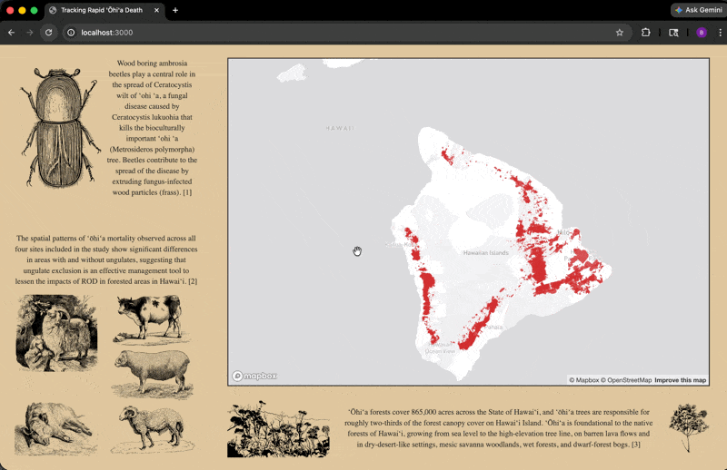
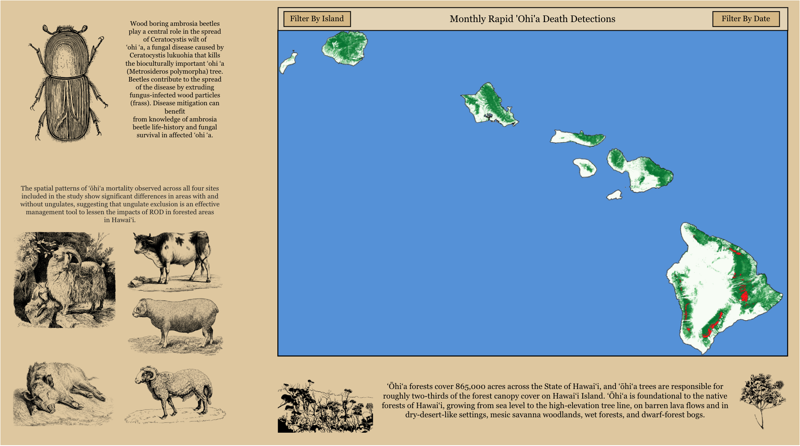
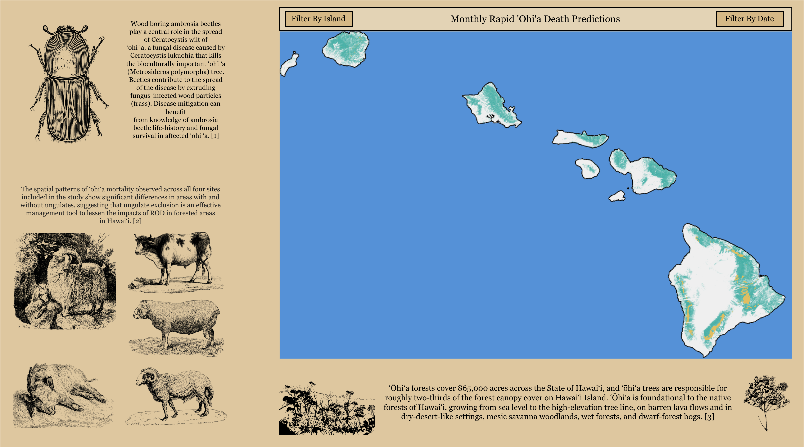

# ROD-WEB-APP

This is a website to host model inference of ROD detections.

## [rapidohiadeath.com](https://www.rapidohiadeath.com) coming soon!

- 
## ROD Communication Experts:

- **Ryan Perroy, Naiʻa Odachi, Joseph Percival, Brian Tucker, JB Friday, and Kylle Roy**
## Progess:
### Ryan Perroy
##### Comments
- "_detections_ is generally a term reserved for a situation where there is a confirmed case, supported by laboratory testing. At least how we've been using the term. You're going to pick up all sorts of changes that have nothing to do with ROD, so you need to keep that in mind. Also, should cite the vegetation layer you're using and I'd be careful about red-green color schemes, there are plenty of colorblind folks."
##### Before
 - 
##### After
- 
#### Brian Tucker
##### Comments
- "Using DMSM labeled data has some concerns about being used to identify detections, and could be misleading in some areas
- I would like to know more about how you are predicting detections
- Usability - seems fairly intuitive, but not sure without seeing the finalized product.  Will it be a static map you continually update, or will it be interactive for the users?
- Clarity -  you'll want to add some sort of legend that shows ohia forest vs predicted detections.  Also, I'm concerned about your #2 diagrams.  You have 3 photos of sheep, 1 cow, and 1 pig lazily resting.  In reality, pigs are by far the most impactful spreader and damage causer.  Cows cause the most terrible damage to a given forest, but those areas are not widespread.  And sheep are less of a factor overall, given their occurrence at higher elevations where ROD detections are significantly less.
- Engagement - What is your overall purpose with this.  It looks like it will provide important information, but highlighting what actions people can take may make this more engaging."
##### Before
- 
- 
