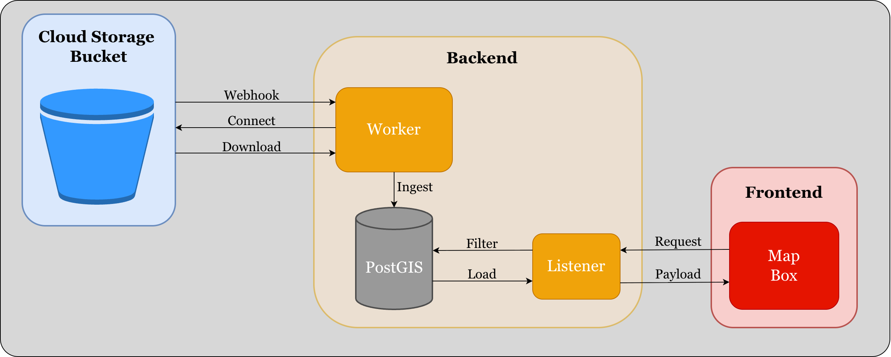

- Our planned backend design utilizes **PostGIS SQL functions** to serve **Mapbox Vector Tiles** (MVT). A **worker** process will collect predicted detections in .geojson format from a **Google Cloud bucket** and insert them into the **PostGIS database**.
