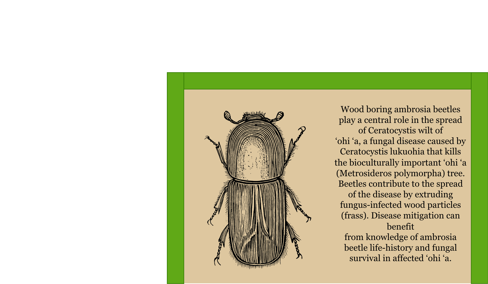

### Covariate Flexbox

```css
flex-direction: column
justify-content: center
align-items: stretch
```

- 

#### Beetle Flexbox

```css
.flex-row-container {
  display: flex;
  flex-direction: row;
  justify-content: center; /* Centers items if they don't fill width */
  align-items: stretch; /* Ensures both sides have equal height */
}

.flex-item-half {
  flex: 1 1 50%; /* flex-grow: 1, flex-shrink: 1, basis: 50% */
  flex-shrink: 0; /* Keep this for SVGs as noted in your guide */
}
```

- 

#### Ungulate Flexbox

```css
.covariate-container {
  display: flex;
  flex-direction: column;
  height: 100%; /* Ensure container has height to distribute */
}

.beetle-section {
  flex: 0 0 35%;
}
.spacer-section {
  flex: 0 0 5%;
}
.ungulate-section {
  flex: 0 0 60%;
}
```

- 
